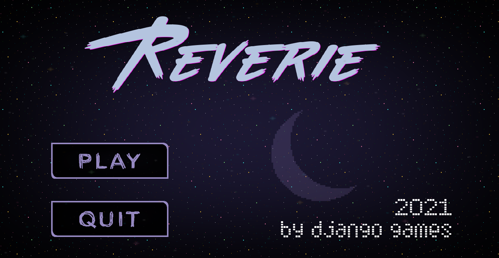

# reverie

*A journey throughout oneself's thoughts and against inner turmoil, searching for treasures that will tether you to a new dawn.*

A game by Django Games for 2021's edition of the Caracas Game Jam (official site for the Global Game Jam), built in Godot. 

## List of Assets

* Handwritten font used in intro and outro: [Scriptina](https://www.1001fonts.com/scriptina-font.html). 
* Credits (Dawn) scene background: [The Dawn](https://saurabhkgp.itch.io/the-dawn-parallax-background) by saukgp on itch.io 
* Various SFX: [Horror SFX Volume 1](https://obsydianx.itch.io/horror-sfx-volume-1) by ObsydianX on itch.io 
* Various SFX: [UI buttons | Sound effects pack + GLITCHES](https://kasse.itch.io/ui-buttons-sound-effects-pack) by kasse on itch.io 
* Radar SFX: [Ship Radar](https://freesound.org/people/Eschwabe3/sounds/459838/) by Eschwabe3 on Freesound 
* Villain SFX: [galacticmessage1.wav](https://freesound.org/people/vumseplutten1709/sounds/243568/) by vumseplutten1709 
* Moon asset: [Background Set](https://kvsr.itch.io/background-set-pixel-assets) by NYKNCK 
* Title and credits font: [The Midnight](https://www.fontget.com/font/the-midnight/) 
* UI/Menu buttons: [Menu Buttons](https://nectanebo.itch.io/menu-buttons) by Nectanebo on itch.io 
* Star assets: [Starry Space Parallaxing Background](https://enjl.itch.io/background-starry-space) by Enjl on itch.io 
* Character sprite: [Elements Supremacy Assets](https://erikari.itch.io/elements-supremacy-assets) by Erikari on itch.io 
* Space assets: [SPACE](https://vectorpixelstar.itch.io/space) by VECTORPIXELSTAR on itch.io 
* Bell SFX: [Free Bell Sound Effects](https://mixkit.co/free-sound-effects/bell/) - Mixkit 
* Gem assets: [SET GEMS ICON](https://ilustragm.itch.io/set-gems-icon-01) by Giacomo Magalhães - GM ilustra on itch.io 
* Water background: [Underwater Fantasy Pixel Art Environment](https://ansimuz.itch.io/underwater-fantasy-pixel-art-environment) by ansimuz on itch.io 
* Tiles: [Mushy - an asset pack of neural network generated isometric tiles](https://everestpipkin.itch.io/mushy) by everestpipkin on itch.io
